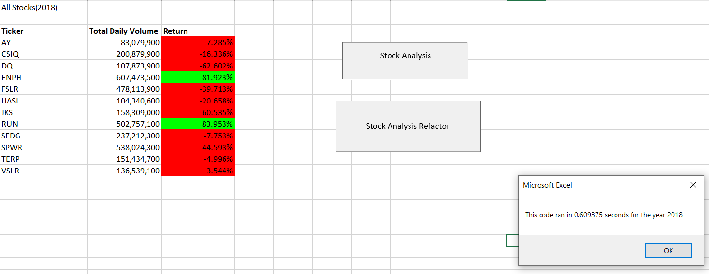
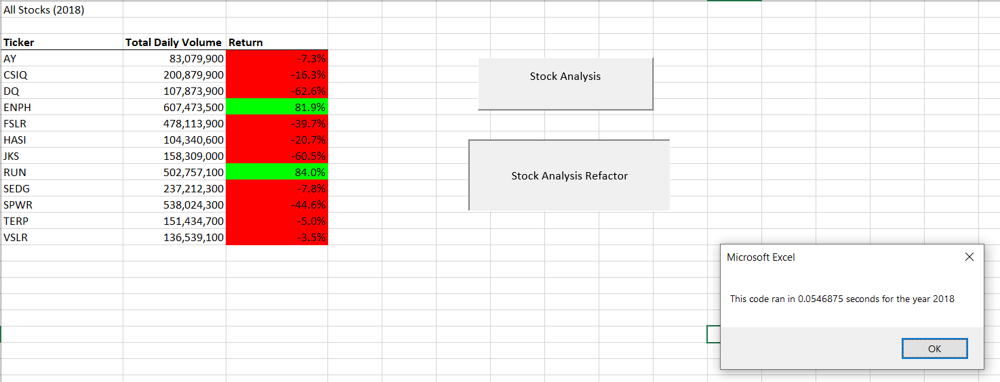
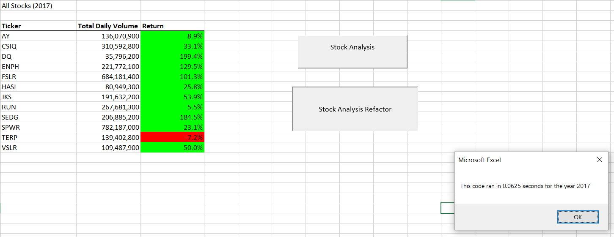

# Stock-Analysis
Stock Analysis Repository

## Overview of Project

### Purpose

The purpose of this project is to do a Stock Analysis on a few stock indecies. By calculating the overall percent change of the Stock year over year, we can see how a specific stock has performed in the long term. By analyzing these stocks side by side, we can then get a clear picture of the individual performance and overall performance as we compare it to other stocks. 

### Background

In addition to this analysis, the client wanted information for a specific stock index (DQ). However, the client also wanted Stock Indices to compare overall growth. The VBA that was programmed for this data anaylizes the yearly information calculate two things: (1) The Total Daily Volume of Stock and (2) The percent change in Stock from the beginning of the year to the end. The analysis currently holds data for 2017 and 2018 but can easily be used to analyze any further years by simply importing the daily Stock information.

## Results

### Module 2018
Following a basic nested loop approach to calculating the two values (total volume and return), the performance of the file came out to approximately 0.61 seconds (as shown in the image here:

### Refactor 2018
Following a more refined process to refactor the volume and return, the performance came out to approximately 0.05 secionds. The original program took almost 12 times as long!

### Refactor 2017
For further insight, we can see the Stock Performances in 2017 as well.

### Analysis
Overall, it can be seen that DQ, the client's primary stock of focus, has underperformed this year with a return of -62.6%. Overall, it can be seen that many stocks underperformed in 2018 with the average return falling 8.512%. However, despite this common trend, DQ has definitely falled more. In addition, DQ's Total Daily Volume falls below the average of 275,503,183.

Looking a little deeper, we can see that in 2017, DQ has overperformed other stocks with a nearly 200% return. This might have made DQ look favorable but it looks like time has evened things out for DQ. With more data, we may be able to see if 2017 is more indicative of this stock's potential or if 2018 simply put DQ back in its rightful place.

## Summary
Refactoring code is the process of rethinking the logic of the program to determine if there is a more efficient and cleaner way to apply the same outcome. The advantage of refactoring code is that it can streamline the program making it run smoother and preparing it for any future versions/iterations. This can make it so the client can save valuable time and make the data analysis much more effective. The disadvantage, however, is that it can be very time consuming to refactor code. Often times it can lead to little results. Sometimes, the program might even take longer or might break in the process. Although we can simply revert the program, it can be time consuming.

The benefit of the refactored code is that it takes a fraction of the time to do the same analysis. This can be advantageous for the client if we were to scale this project long term for many years. However, there are still limitations to the refactored code. The refactored code still doesn't allow for additional tickers to be added in. In the future, if other stocks were to open that the client is interested in, this program would fail. The original code, however, is no better as it uses the same array logic to hold data on the tickers. We could improve in a further iteration to create a logic for detecting all tickers in the file, hopefully with much efficiency.
